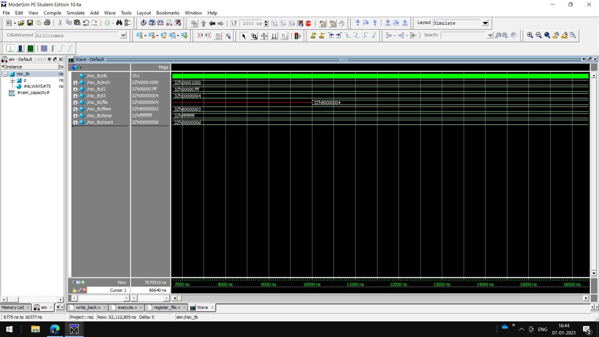

# RISC-Processor-32-bit-Verilog
32 bit RISC Processor 
[RISC Processor](risc.jpg)

<h2>Reference</h2>
<h3>[1]Basic Idea:https://www.eg.bucknell.edu/~csci320/2014-fall/#!single.md</h3>
<h2>Future Plans</h2>
In my next project I am going to implement the concept of Single Cycle Processor with better design idea.
Please give me suggestions how I can improve this project and if you are a student like me, we can have a discussion and you are always welcome to discuss and contact me.

